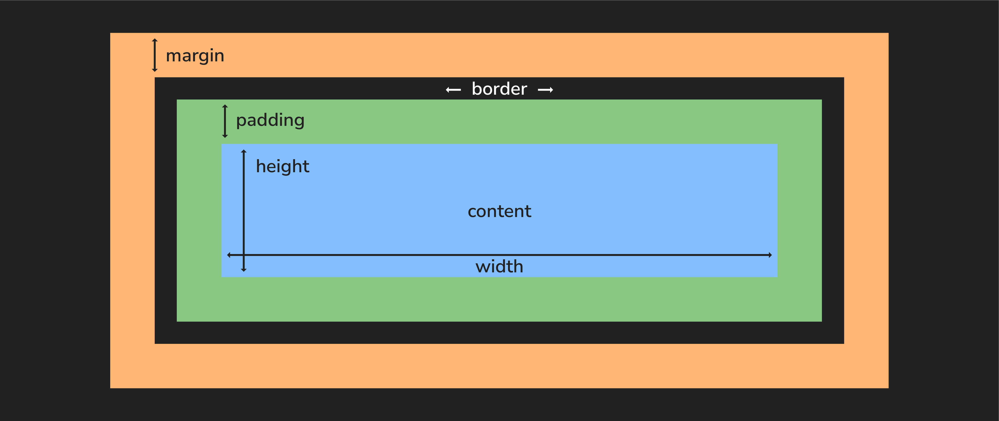
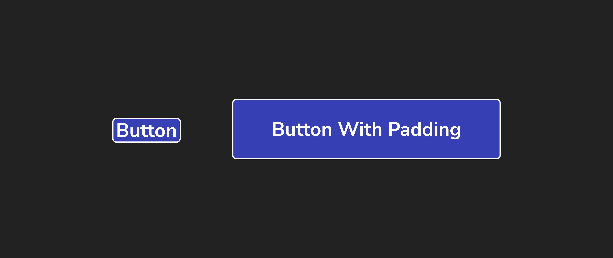

<h1>
  <span class="headline">Intro to CSS</span>
  <span class="subhead">The Box Model</span>
</h1>

**Learning objective:** By the end of this lesson, learners will be able to apply the CSS box model concepts of content, padding, border, and margin to manipulate the layout and spacing of HTML elements.

## Everything is a box

Every HTML element creates a box for its content. CSS can be used to modify that box through the box model. The box model is a way to visualize the space that each element takes up on the page. The box model is made up of 4 parts: **content**, **padding**, **border**, and **margin**.



Although other CSS units can be used, we'll typically measure these boxes in pixels, abbreviated in code as `px`.

## Content

The content of the box, where text and images appear.

## Padding

[Padding](https://developer.mozilla.org/en-US/docs/Web/CSS/padding) is the space between the content of an element and its border.

Padding can be added to any side of an element, and it can be different thicknesses on different sides. Padding is useful for creating space between the content of an element and its border or margin.



Adjusting the padding will shift the box's content but will not impact neighboring elements.

When we use a single value, it gets applied to all four sides:

```css
p {
  /* all four sides */
  padding: 2px;
}
```

You can also target a specific side of a box's padding like this:

```css
p {
  padding-bottom: 1px;
  padding-left: 2px;
  padding-right: 3px;
  padding-top: 4px;
}
```

You can also target different sides by using shorthand properties. The `border` property below previews this concept as well.

## Border

A [border](https://developer.mozilla.org/en-US/docs/Web/CSS/border) is the area (typically a line) surrounding the padding. Borders are useful for separating elements from each other and adding visual interest to a web page.

We can set the value of the border's width, style, and color all in one line using the `border` shorthand property:

```css
p {
  border: 3px solid red;
}
```

Or, if we wanted, we could break this into three lines:

```css
p {
  border-width: 3px;
  border-style: solid;
  border-color: red;
}
```

We can even control individual sides with properties that target them, like `border-bottom-width` and `border-bottom-style`, though this is less common.

## Margin

[Margin](https://developer.mozilla.org/en-US/docs/Web/CSS/margin) is the space between the border and other elements.

Margins can be added to any side of an element, and they can be different thicknesses on different sides. Margins help create space between elements and control a web page's layout.

We can manipulate the value of the margin property the same way as the padding property:

```css
p {
  /* all four sides */
  margin: 2px;
}
```

`margin-top`, `margin-right`, and so on are also available.
