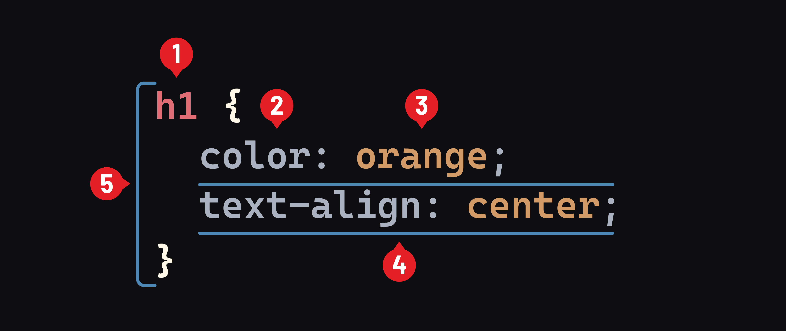

<h1>
  <span class="headline">Intro to CSS</span>
  <span class="subhead">Fundamentals</span>
</h1>

**Learning objective:** By the end of this lesson, learners will understand and apply the basic syntax of CSS, including the use of selectors, properties, and values, to effectively style HTML elements.

## Syntax

The following graphic shows the basic syntax of a CSS rule:



**Selectors:** Used to target the element(s) to be styled and range from simple to incredibly complex.

**Properties:** A few hundred CSS properties can be used to style elements. For example, the `color` property shown above sets the color of an element's text. Properties are written in `lower-kebab-case`. In this convention, each word is written in lower case and separated by a dash `-`. This differs from `camelCase`, where the first word is written in lowercase, and each subsequent word is capitalized. In `camelCase`, words are not separated by any characters.

**Value:** The value assigned to the `color` property controls the color of an element's text. The valid values that can be applied to a property are specific to that property. For example, it can be given named values like `orange` or specific colors using a special syntax. Meanwhile, the `text-align` property can only be given a few values, such as `left`, `justify`, or `center`. A value of `orange` would be invalid. Values are also written in `lower-kebab-case`.

**Declaration:** The combination of a *property* and *value*, separated by a colon and ending with a semi-colon, makes a declaration.

**Rule:** A selector and all of its associated declarations.

## Element selectors

CSS element selectors target every instance of a specific HTML element, such as `<p>`, on a web page. Element selectors are the most basic type of selector. They are defined in the HTML with the element name.

```html
<!--A p element-->
<p>Hello World</p>
```

To target that `p` element and every other `p` element on the page and make the color of their text purple, we could use this code:

```css
p {
  color: purple;
}
```

## Comments

Like comments in other languages, comments explain and document our CSS code. Browsers ignore these comments, so they don't affect the appearance of our web pages.

CSS comments start with a forward slash and an asterisk `/*` and end with an asterisk and a forward slash `*/`. They can span multiple lines or one line, but they need both the opening and closing tags.

```css
p {
  color: purple; /*All p elements will now have purple text!*/
}

/* 
This is 
a multi-line
comment.
*/
```

> 🧠 VS Code can automatically comment line(s) of code for us by pressing `⌘ Command` + `/` in macOS or `Ctrl` + `/` in Linux and Windows.
